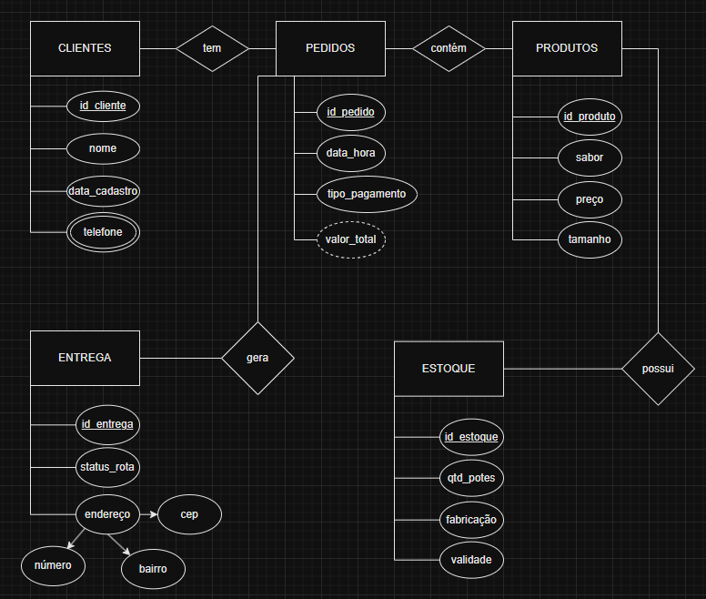
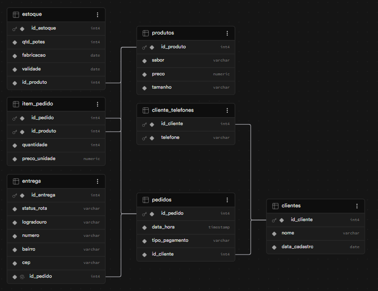
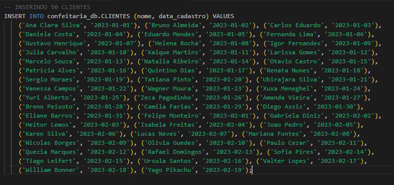
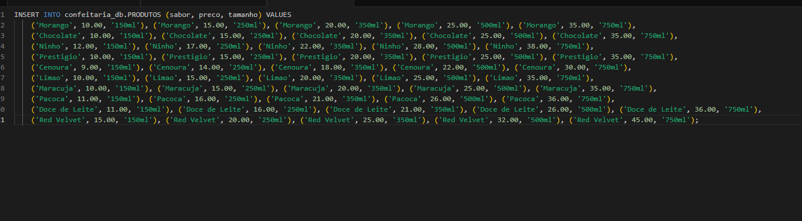
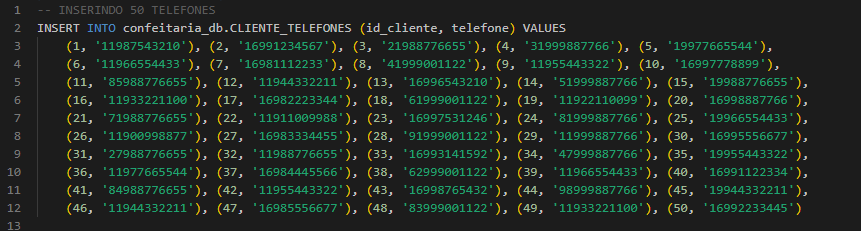

# Trabalho-BD-Faculdade

Essa é uma **Modelagem de Banco de Dados** feita para um trabalho da **Faculdade (FATEC)**, onde é realizado a:
- Criação de Cenário
- Descrição Textual
- Modelo Conceitual (DER)
- Modelo Lógico
- Modelo Físico (SQL)
- CRUD
  - **C** - `CREATE`
  - **R** - `READ`
  - **U** - `UPDATE`
  - **D** - `DELETE`


## CENÁRIO

O sistema gerencia as vendas e o cardápio de uma confeitaria artesanal focada em bolos de pote. Clientes realizam pedidos que podem conter diferentes quantidades e sabores de bolos disponíveis no catálogo. Cada pedido registra informações essenciais como a forma de pagamento escolhida, o status de entrega no endereço do cliente e o preço unitário de cada produto no momento da compra, garantindo um histórico de faturamento preciso mesmo que os preços do cardápio mudem no futuro.

---

## MODELO CONCEITUAL



---

## DESCRIÇÃO TEXTUAL

- **Clientes**(id_cliente, nome, data_cadastro)
- **Cliente_Telefones**(id_cliente, telefone)
- **Produtos**(id_produto, sabor, preco, tamanho)
- **Estoque**(id_estoque, qtd_potes, fabricacao, validade, id_produto)
- **Pedidos**(id_pedido, data_hora, tipo_pagamento, id_cliente)
- **Entrega**(id_entrega, status_rota, logradouro, numero, bairro, cep, id_pedido)
- **Item_Pedido**(id_pedido, id_produto, quantidade, preco_unidade)
---

## MODELO LÓGICO



---

## MODELO FÍSICO

#### O código **SQL** abaixo cria o schema e todas as tabelas necessárias para o banco de dados da confeitaria:
```
-- Criando SCHEMA
CREATE SCHEMA IF NOT EXISTS confeitaria_db;

-- Tabela CLIENTES
CREATE TABLE IF NOT EXISTS confeitaria_db.CLIENTES (
    id_cliente SERIAL PRIMARY KEY,
    nome VARCHAR(100) NOT NULL,
    data_cadastro DATE NOT NULL
);

-- Tabela PRODUTOS
CREATE TABLE IF NOT EXISTS confeitaria_db.PRODUTOS (
    id_produto SERIAL PRIMARY KEY,
    sabor VARCHAR(100) NOT NULL,
    preco DECIMAL(10, 2) NOT NULL,
    tamanho VARCHAR(50) NOT NULL
);

-- Tabela TELEFONES
CREATE TABLE confeitaria_db.CLIENTE_TELEFONES (
    id_cliente INT NOT NULL,
    telefone VARCHAR(20) NOT NULL,
    PRIMARY KEY (id_cliente, telefone),
    FOREIGN KEY (id_cliente) REFERENCES confeitaria_db.CLIENTES(id_cliente)
);

-- Tabela ESTOQUE
CREATE TABLE confeitaria_db.ESTOQUE (
    id_estoque SERIAL PRIMARY KEY,
    qtd_potes INT NOT NULL,
    fabricacao DATE NOT NULL,
    validade DATE NOT NULL,
    id_produto INT NOT NULL,
    FOREIGN KEY (id_produto) REFERENCES confeitaria_db.PRODUTOS(id_produto)
);

-- Tabela PEDIDOS
CREATE TABLE confeitaria_db.PEDIDOS (
    id_pedido SERIAL PRIMARY KEY,
    data_hora TIMESTAMP NOT NULL DEFAULT CURRENT_TIMESTAMP,
    tipo_pagamento VARCHAR(50) NOT NULL,
    id_cliente INT NOT NULL,
    FOREIGN KEY (id_cliente) REFERENCES confeitaria_db.CLIENTES(id_cliente)
);

-- Tabela ENTREGA 
CREATE TABLE confeitaria_db.ENTREGA (
    id_entrega SERIAL PRIMARY KEY,
    status_rota VARCHAR(50) NOT NULL,
    logradouro VARCHAR(150) NOT NULL,
    numero VARCHAR(20) NOT NULL,
    bairro VARCHAR(100) NOT NULL,
    cep VARCHAR(20) NOT NULL,
    id_pedido INT NOT NULL UNIQUE, 
    FOREIGN KEY (id_pedido) REFERENCES confeitaria_db.PEDIDOS(id_pedido)
);

-- Tabela ITEM_PEDIDO 
CREATE TABLE confeitaria_db.ITEM_PEDIDO (
    id_pedido INT NOT NULL,
    id_produto INT NOT NULL,
    quantidade INT NOT NULL,
    preco_unidade DECIMAL(10, 2) NOT NULL,
    PRIMARY KEY (id_pedido, id_produto), 
    FOREIGN KEY (id_pedido) REFERENCES confeitaria_db.PEDIDOS(id_pedido),
    FOREIGN KEY (id_produto) REFERENCES confeitaria_db.PRODUTOS(id_produto)
);
```
## INSERÇÃO DE DADOS

#### Inserindo dados na tabela _CLIENTES_:


#### Inserindo dados na tabela _PRODUTOS_:


#### Inserindo dados na tabela _CLIENTE_TELEFONE_:

